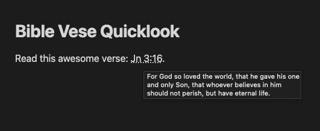

# Bible Verse Quicklook 🔍

### Features
- 📖 Hover over a Bible verse or abbrevation to see it's full text.



### Development

To get started, set up your local dev environment by following steps 1–3 in the [official Obsidian docs for building a plugin](https://docs.obsidian.md/Plugins/Getting+started/Build+a+plugin#Step+1+Download+the+sample+plugin).

Basically, the steps look like this:
```shell
mkdir -p bible-verse-quicklook/.obsidian/plugins
cd bible-verse-quicklook/.obsidian/plugins
git clone https://github.com/joeriddles/bible-verse-quicklook.git
npm i
npm run dev
```

Then open the top-level `bible-verse-quicklook/` folder in Obsidian as a new vault, enable community plugins in the settings, and enable the Bible Verses Quicklook plugin.

Remember to run `npm run dev` while developing or you won't see your changes in Obsidian.

### Release

**Note: releases are now done using GitHub Actions and Releases.**

To update the package version:
```shell
npm version [major|minor|patch]
```

To create a release:
```shell
git tag x.y.z  # done by `npm version`
git push origin --tags
```
